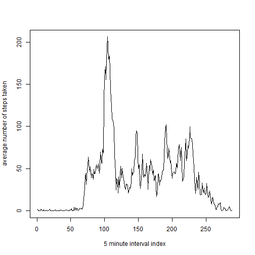
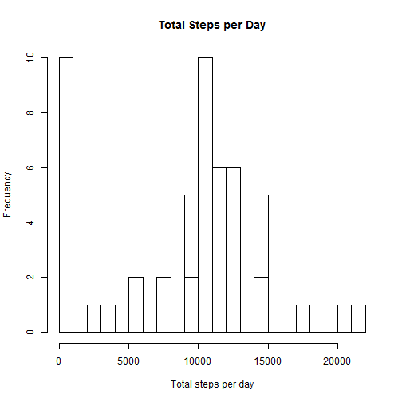
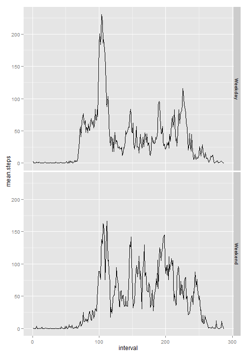

# Reproducible Research: Peer Assessment 1 


---
author: "Goran Strangmark"
date: "Sunday, August 17, 2014"
output: html_document
---


This is my solution for the first peer assessment in Reproducible Research class.

**Loading and preprocessing the data**

Show any code that is needed to

1. Load the data (i.e. read.csv())

2. Process/transform the data (if necessary) into a format suitable for your analysis


```r
unzip("./activity.zip")
actData <- read.csv("activity.csv")
```

**What is mean total number of steps taken per day?**

For this part of the assignment, you can ignore the missing values in the dataset.

1. Make a histogram of the total number of steps taken each day

2. Calculate and report the mean and median total number of steps taken per day


```r
totStepDay <- with(actData, tapply(steps, date, sum, na.rm=T))
hist(totStepDay, breaks=20, xlab="Total steps per day", main="Total Steps per Day")
```

 

```r
## calculate mean and median number of steps taken per day
meanStepDay <- mean(totStepDay)
medianStepDay <- median(totStepDay)
print(paste("Mean number of steps per day is",round(meanStepDay)))
```

```
## [1] "Mean number of steps per day is 9354"
```

```r
sprintf("Median number of steps per day is %s", medianStepDay)        
```

```
## [1] "Median number of steps per day is 10395"
```


**What is the average daily activity pattern?**

1. Make a time series plot (i.e. type = "l") of the 5-minute interval (x-axis) and the average number of steps taken, averaged across all days (y-axis)

2. Which 5-minute interval, on average across all the days in the dataset, contains the maximum number of steps?


```r
meanStep5min <- with(actData, tapply(steps, interval, mean, na.rm=T))
plot(meanStep5min, type="l",xlab="5 minute interval index", ylab="average number of steps taken")
```

 

```r
##find the interval with highest average number of step
maxMeanSteps <- max(meanStep5min)
maxInterval <- match(meanStep5min, maxMeanSteps)
for (i in 1:length(maxInterval)) {
        if (!is.na(maxInterval[i])) max_i=i
}
interval_id <- names(meanStep5min[max_i])
print(paste("Interval", interval_id, "has the highest mean number of steps (",round(maxMeanSteps,2),")"))
```

```
## [1] "Interval 835 has the highest mean number of steps ( 206.17 )"
```

**Imputing missing values**

Note that there are a number of days/intervals where there are missing values (coded as NA). The presence of missing days may introduce bias into some calculations or summaries of the 
data.

1. Calculate and report the total number of missing values in the dataset (i.e. the total number of rows with NAs)

2. Devise a strategy for filling in all of the missing values in the dataset. The strategy does not need to be sophisticated. For example, you could use the mean/median for that day, or 
the mean for that 5-minute interval, etc.

3. Create a new dataset that is equal to the original dataset but with the missing data filled in.

4. Make a histogram of the total number of steps taken each day and Calculate and report the mean and median total number of steps taken per day. Do these values differ from the estimates 
from the first part of the assignment? What is the impact of imputing missing data on the estimates of the total daily number of steps?


```r
numberNA <- sum(is.na(actData[,1]))
print(paste("There are", numberNA, "missing values, which is equal to",round(100*numberNA/length(actData[,1]),2),"% of all observations"))
```

```
## [1] "There are 2304 missing values, which is equal to 13.11 % of all observations"
```

```r
## my strategy for imputing values is to use the mean for the particular 5 minute interval
numberOfDays <- as.integer(as.Date(as.character(actData[length(actData[,1]), 2]))-
                                   as.Date(as.character(actData[1,2])) +1)
numberOfIntervals <- length(actData[,1])/numberOfDays
actDataImp <- actData
actDataImp <-cbind(actDataImp, dayInt=c(rep(1:numberOfIntervals, numberOfDays)))
for (i in 1:length(actDataImp[,1])){
        if (is.na(actDataImp[i,1])) {
                actDataImp[i,1] <- round(meanStep5min[actDataImp[i,4]])
        }      
}
totStepDayImp <- with(actDataImp, tapply(steps, date, sum, na.rm=T))
hist(totStepDay, breaks=20, xlab="Total steps per day", main="Total Steps per Day")
```

 

```r
## calculate mean and median number of steps taken per day
meanStepDayImp <- mean(totStepDayImp)
medianStepDayImp <- median(totStepDayImp)
print(paste("Mean number of steps per day with NAs replaced is",round(meanStepDayImp)))
```

```
## [1] "Mean number of steps per day with NAs replaced is 10766"
```

```r
sprintf("Median number of steps per day with NAs replaced is %s", medianStepDayImp)   
```

```
## [1] "Median number of steps per day with NAs replaced is 10762"
```


**Are there differences in activity patterns between weekdays and weekends?**

For this part the weekdays() function may be of some help here. Use the dataset with the filled-in missing values for this part.

1. Create a new factor variable in the dataset with two levels  *weekday* and *weekend* indicating whether a given date is a weekday or weekend day.

2. Make a panel plot containing a time series plot (i.e. type = "l") of the 5-minute interval (x-axis) and the average number of steps taken, averaged across all weekday days or weekend 
days (y-axis). The plot should look something like the following, which was creating using simulated data:


```r
actDataImp$weekday <- with(actDataImp, as.factor(weekdays(as.Date(as.character(date)))))

wdss <- subset(actDataImp, weekday=="Monday" | weekday=="Tuesday" |weekday=="Wednesday" |weekday=="Thursday" | weekday=="Friday" )
wess <- subset(actDataImp, weekday=="Saturday" | weekday=="Sunday" )
meanStep5minWeekday <- with(wdss, tapply(steps, interval, mean, na.rm=T))
meanStep5minWeekend <- with(wess, tapply(steps, interval, mean, na.rm=T))


library (ggplot2)

## make a smaller data frame with mean values for each interval index and day category only
newDF1 <- data.frame(interval=1:numberOfIntervals, mean.steps=meanStep5minWeekday, day.category="Weekday")
newDF2 <- data.frame(interval=1:numberOfIntervals, mean.steps=meanStep5minWeekend, day.category="Weekend")
newDF <- rbind(newDF1, newDF2)
##qplot
qplot(interval, mean.steps, data=newDF, geom=c("line"), facets=day.category~.)
```

 

Weekend peak activity occurs later than weekday. Overall weekend activity level is lower than weekday.
